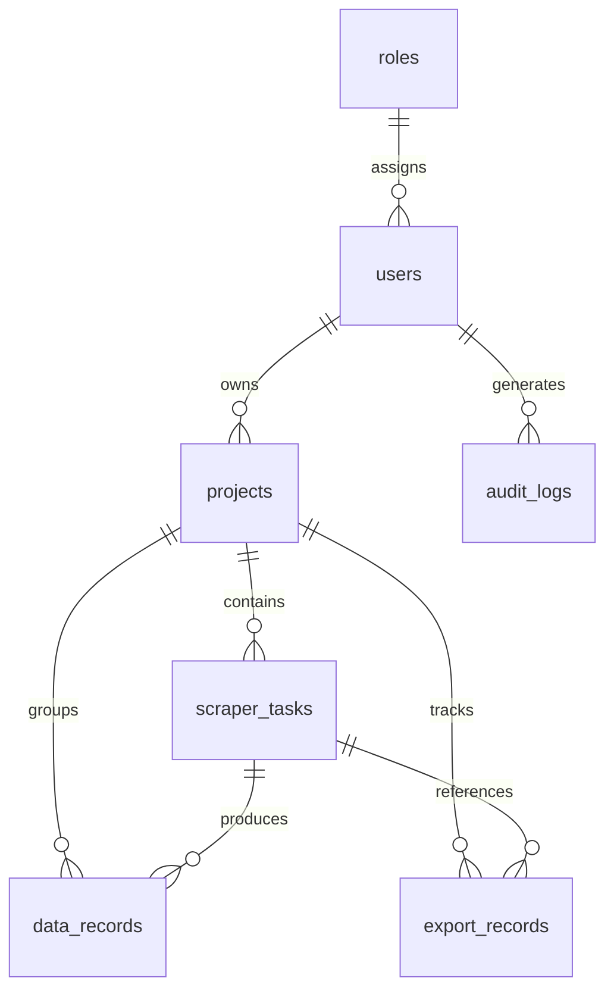

# WebScrape Pro – Intelligent Website Data Extraction Platform

**WebScrape Pro** is an enterprise-grade website scraping, analytics, and data management platform. Built on a modern **Flask/Python** architecture with **SQLAlchemy**, it supports dual parsing modes (BeautifulSoup for speed, Playwright for dynamic Javascript SPAs), multi-threaded background workers, live SSE-based console streaming, role-based access control, and a comprehensive document exporter (JSON, CSV, multi-tab Excel, PDF, ZIP).

---

## 🚀 Key Features

*   🔐 **Secure Session Auth & RBAC**: Hashed credential registration and session-based authentication using **Flask-Login** and **Flask-Bcrypt**, complete with role-based access filters (`Administrator` vs. `Member`).
*   🕷 **Dual-Engine Scraper Architecture**:
    *   **Static Parser**: High-performance HTTP extraction using `requests` and `BeautifulSoup4` with automatic retry limits and exponential back-off (handling HTTP 429/500/502/503/504).
    *   **Dynamic Parser**: Emulated headless browser actions using **Playwright** (supporting Chromium, Firefox, WebKit). Automates viewport configurations, human-like incremental scrolling (lazy-loading bypass), user-agent rotation, and anti-bot mitigation.
    *   **Robots.txt Compliance**: Integrates `urllib.robotparser` to automatically respect website crawling rules (cancellable via config override).
*   🧵 **Background Task Manager**: Concurrent task runner built on native thread pools. Tracks live job states (`PENDING`, `RUNNING`, `COMPLETED`, `FAILED`, `CANCELLED`) with fully thread-safe execution controls and file-system log routing.
*   📡 **Real-time SSE Logs**: Server-Sent Events (SSE) stream detailed engine log feeds directly to client terminals on the web interface.
*   📊 **Aggregated Analytics API**: Live metrics dashboard compiling extraction success rates, data volume counts, and execution durations.
*   📤 **Multi-Format Export Engine**: Compiles database-extracted records into downstream packages:
    *   **JSON**: Raw structured payload dump.
    *   **CSV**: Flattened summary representation.
    *   **Excel**: Professional multi-tab spreadsheet (`Overview`, `Extracted Links`, `Media Assets`) using `xlsxwriter`.
    *   **PDF**: Document reports complete with metadata tables using `ReportLab`.
    *   **ZIP Archive**: Package compiling a master JSON payload alongside individual text files for every crawled page.
*   🎨 **Glassmorphism Theme System**: Modern responsive user interface utilizing custom CSS, transitions, micro-animations, and a persistent dark/light mode toggle.

---

## 🛠 Technology Stack

| Layer | Technologies & Libraries |
| :--- | :--- |
| **Backend Core** | Python 3.10+, Flask 3.0.2 |
| **Database & ORM** | SQLite, Flask-SQLAlchemy 3.1.1 |
| **Security & Auth** | Flask-Login, Flask-Bcrypt, PyJWT, Cryptography |
| **Scraping Engines** | Playwright 1.42.0, BeautifulSoup 4.12.3, Requests, urllib3 |
| **Export Services** | XlsxWriter, OpenPyXL, ReportLab 4.1.0, zipfile |
| **Deployment** | Docker, Gunicorn, Docker Compose |

---

## 📂 Repository Structure

The project follows a standard Flask application factory layout:

```text
WebScrape Pro/
├── app/
│   ├── __init__.py           # Application factory, blueprint registration & seeder
│   ├── config.py             # Config profiles (Development, Production, Testing)
│   ├── extensions.py         # SQLAlchemy, Bcrypt, and LoginManager initialization
│   ├── models.py             # SQLAlchemy DB schemas and ORM mapping relationships
│   ├── routes/
│   │   ├── auth.py           # Handles register, login, logout, and profile views
│   │   ├── main.py           # Renders main console dashboards and project pages
│   │   ├── scraper.py        # Starts/stops scraping tasks and streams SSE logs
│   │   ├── api.py            # Restful JSON API for Projects, Tasks, and Analytics
│   │   └── exports.py        # Triggers download exports for multiple formats
│   ├── services/
│   │   ├── task_manager.py   # Thread-safe background execution and file logger
│   │   ├── exporter.py       # Exporter helper for JSON, CSV, Excel, PDF, and ZIP
│   │   └── scraper/
│   │       ├── base_scraper.py      # Abstract base class with robots.txt parsing
│   │       ├── static_scraper.py    # Request-based static HTML parser
│   │       └── dynamic_scraper.py   # Playwright-driven JS renderer and scroll emulator
│   ├── static/
│   │   └── css/
│   │       └── style.css     # Premium UI styling, custom variables, and dark theme
│   └── templates/            # Jinja2 templates (dashboard, profiles, auth, errors)
├── tests/
│   └── test_basic.py         # Unit tests validating models, seeders, and isolated parser
├── Dockerfile                # Production container runner compiling Playwright system libs
├── docker-compose.yml        # Docker compose coordinator mapping db files and ports
├── requirements.txt          # Managed application package requirements
├── run.py                    # Application launch script
├── run_demo.py               # Headless end-to-end programmatic verification script
└── README.md                 # System overview documentation
```

---

## 🗄 Database Schema (SQLite ORM)



### Table Properties

1.  **Role (`roles`)**: Defines client roles. Default: `Administrator`, `Member`.
2.  **User (`users`)**: Stores credentials (`username`, `email`, `password_hash`), active status, and timestamps.
3.  **Project (`projects`)**: Sandbox boundaries. Each project belongs to a user and aggregates related tasks and data records.
4.  **ScraperTask (`scraper_tasks`)**: Execution run record tracking target URL, `status`, `configuration` (JSON parameters), runtime timestamps, database yields, and disk log file path.
5.  **DataRecord (`data_records`)**: Collected dataset records containing `data_content` (JSON storing extracted page metadata, headers, paragraphs, links, contacts, media, and custom selectors).
6.  **ExportRecord (`export_records`)**: Compiled output download files tracking output paths, file sizes, and formats.
7.  **AuditLog (`audit_logs`)**: Security log indexing administrative and scraper actions mapped to client IPs.

---

## ⚙ Scraper Configuration Parameters

Scraper tasks receive configuration schemas in serialized JSON format:

```json
{
  "depth": 1,
  "dynamic": true,
  "timeout": 15,
  "rate_limit": 1.0,
  "ignore_robots_txt": false,
  "browser_type": "chromium",
  "headless": true,
  "scroll_pages": 2,
  "wait_time": 3.0,
  "selectors": {
    "pricing": ".product-price",
    "product_titles": "h2.product-name"
  }
}
```

### Configuration Keys:
*   `depth`: Crawl depth limits (default `1`).
*   `dynamic`: If `true`, executes the Playwright JavaScript-rendering browser pipeline. If `false`, executes the lightweight requests parsing pipeline.
*   `timeout`: HTTP navigation request limits (in seconds).
*   `rate_limit`: Pause interval between subsequent requests to prevent IP throttling.
*   `ignore_robots_txt`: If `true`, bypasses robots.txt checks.
*   `browser_type`: Chooses Playwright environment engine (`chromium`, `firefox`, `webkit`).
*   `scroll_pages`: Iterations of incremental vertical scrolls to trigger lazy loading.
*   `wait_time`: Rendering delay after page load for JavaScript scripts to stabilize.
*   `selectors`: Optional dictionary mapping custom fields to CSS selector paths.

---

## 📡 REST API Reference

All REST endpoints reside under the `/api` prefix and require cookie-based authentication (`@login_required`).

| Endpoint | Method | Description |
| :--- | :--- | :--- |
| `/api/projects` | `GET` | Returns list of all projects owned by active user. |
| `/api/projects` | `POST` | Creates a new project workspace. Required JSON payload: `{"name": "...", "description": "..."}`. |
| `/api/projects/<id>` | `GET` | Returns specific project metadata alongside all associated tasks. |
| `/api/projects/<id>` | `PUT` | Updates project details. Payload parameters: `name`, `description`. |
| `/api/projects/<id>` | `DELETE` | Deletes a project and cascades deletion to all scraper runs, tasks, logs, and export records. |
| `/api/tasks` | `GET` | Retrieves all task logs. Optional filter: `?project_id=<id>`. |
| `/api/tasks/<id>/data` | `GET` | Returns a list containing the extracted JSON payloads of data records generated by the task. |
| `/api/analytics` | `GET` | Returns aggregated metrics: counts of projects, task status summaries (success rates), total rows extracted, export counts, and average run times. |

---

## 🏁 Installation & Setup

### Option 1: Local Virtual Environment Setup

1.  **Clone the Repository**:
    ```bash
    git clone https://github.com/krushillukhi/synent-task8-webscrapepro-krushillukhi.git
    cd synent-task8-webscrapepro-krushillukhi
    ```

2.  **Create and Activate Virtual Environment**:
    ```bash
    python3 -m venv venv
    source venv/bin/activate  # On Windows use: venv\Scripts\activate
    ```

3.  **Install Required Libraries**:
    ```bash
    pip install -r requirements.txt
    ```

4.  **Install Playwright Headless Browsers**:
    ```bash
    playwright install
    ```

5.  **Run the Server**:
    ```bash
    python run.py
    ```
    The application will automatically initialize the SQLite database, seed default user roles, and run a web server at `http://127.0.0.1:5000`.

6.  **Default Seeded Credentials**:
    *   **Username**: `admin`
    *   **Password**: `AdminPass123!`

---

### Option 2: Docker Compose Setup

Run the application inside containerized environments. Docker automatically provisions system libraries needed by Chromium and Playwright.

```bash
# Build and spin up the containers
docker-compose up --build
```

The container routes to port `5000` on your localhost (`http://localhost:5000`) and mounts a database volume safely to protect SQLite state.

---

## 🧪 Verification & Testing

### Programmatic Integration Demo
Run the end-to-end programmatic verification script. This initializes an isolated Flask application context, logs in as administrator, schedules a scraping run targeting quotes web pages, logs console activities, processes result payloads, and outputs a formatted spreadsheet.

```bash
python run_demo.py
```

### Automated Unit Tests
Run the project's test suite containing seeder validations, database ORM integrity tests, role mappings, and isolated offline HTML parser checks:

```bash
python -m unittest tests/test_basic.py
```
